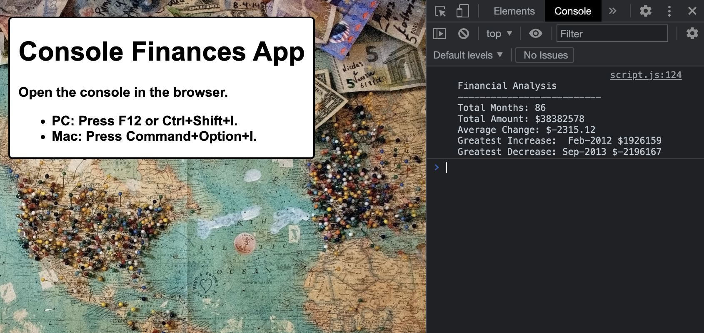

# challenge-4-console-finances

## Description

Project is a simple financial analysis application prepared in Javascript and displayed in browser's console.
Input dataset is composed of arrays with two fields, Date and Profit/Losses.
JavaScript code analyzes the records to calculate each of the following:

<ul>
    <li>The total number of months included in the dataset.</li>
    <li>The net total amount of Profit/Losses over the entire period.</li>
    <li>The average of the changes in Profit/Losses over the entire period.</li>
    <li>Track the total average change in profits from month to month.
        (Total/Number of months)</li>
    <li>The greatest increase in profits (date and amount) over the entire period.</li>
    <li>The greatest decrease in losses (date and amount) over the entire period.</li>
</ul>

## Installation

Application is deployed in <a href=" https://martamilewczyk.github.io/challenge-4-console-finances/">Github</a>

## Usage

## Credits

Background photo by <a href="https://unsplash.com/fr/@agent_illustrateur?utm_source=unsplash&utm_medium=referral&utm_content=creditCopyText">Christine Roy</a> on <a href="https://unsplash.com/@x7martika/likes?utm_source=unsplash&utm_medium=referral&utm_content=creditCopyText">Unsplash</a>

## License
Project is licensed under the <a href="LICENSE">MIT License</a>.

---
